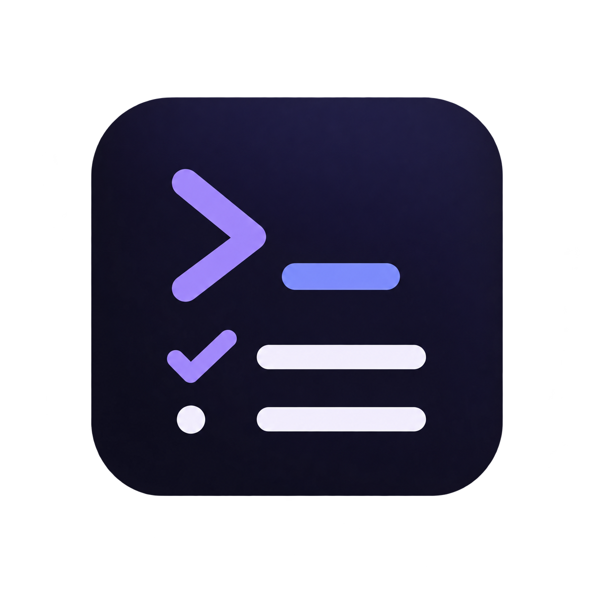
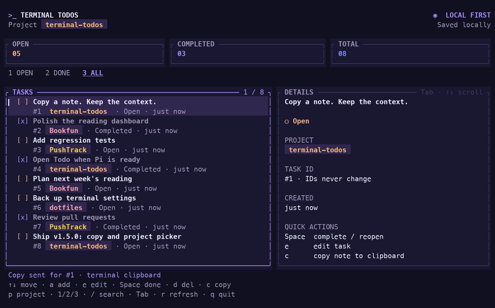
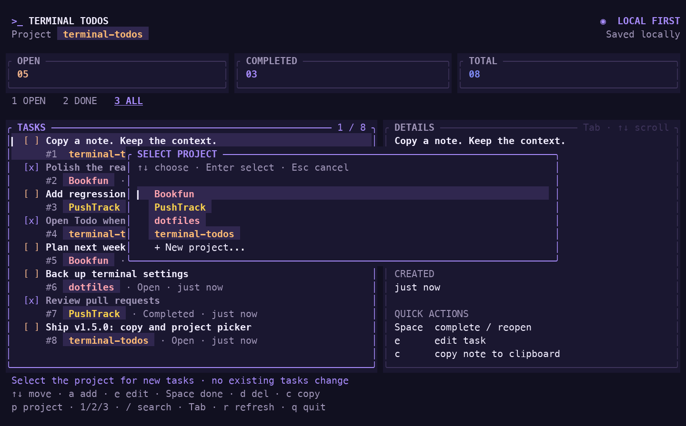

<p align="center">
  
</p>

<h1 align="center">Terminal Todos</h1>

<p align="center">A simple, keyboard-first todo app for your terminal. Built with Rust.</p>

## New in v1.5.0

**Copy a note. Choose its project. Stay in the terminal.**

- **`c` — copy the full note.** Send the selected note's text to your terminal clipboard (OSC52), not just the visible snippet.
- **`p` — choose a project without changing folders.** Pick an existing name or enter a new one for subsequent notes. Existing notes keep their labels.
- **`/todo` — let Pi finish first.** Approve waiting for a busy turn, then open the dashboard without automatically interrupting Pi.

Project context stays visible through consistent colored badges, inside Pi and in the standalone app.



## Use inside Pi

Open the dashboard without leaving [Pi](https://pi.dev/). Supports macOS 11+ and Linux on **arm64 / x64**; no Rust or Homebrew installation needed.

### 1. Install the Pi package

Run this in your **terminal**, not as a Pi slash command:

```bash
pi install git:github.com/TemelGunaydin/terminal-todos@v1.5.0
```

This installs the extension for your user. Add `--local` to install it only for the current project; project extensions require Pi's project-trust approval.

### 2. Reload and open

If Pi is already running, enter these commands **inside Pi**, one at a time:

```text
/reload
/todo
```

Otherwise, start `pi` and run `/todo`. You can also press **Ctrl+Alt+T**.

### 3. Approve the first download

If the managed app is missing, Pi asks **“Install Terminal Todos?”**. Approve to download the binary for your OS/CPU from the matching GitHub release. Its SHA-256 and version are checked before installation completes.

- Nothing is downloaded just by starting Pi.
- **Esc / Ctrl+C** cancels the download.
- Subsequent launches use the verified local copy without downloading again.
- Pi uses its own executable; it does **not** install or upgrade your Homebrew `todo`, or change your PATH.

### Pi shortcuts

| Command / key | Action |
| --- | --- |
| `/todo` | Open the dashboard |
| `Ctrl+Alt+T` | Open it without typing a command |
| `q` / `Ctrl+C` in the dashboard | Close Todo and return to Pi |
| `/reload` in Pi | Reload installed extensions |

Your unsent Pi editor text is preserved. The dashboard only takes the terminal while Pi is **idle**; print, JSON and RPC modes cannot launch it. In v1.5.0, `/todo` during an active turn offers to wait for it to finish. Declining does nothing; accepting does not interrupt Pi or remove queued messages. The shortcut still asks you to wait or stop Pi yourself. Queued messages must finish, or be restored with Pi's `Alt+Up`, before opening.

## Use as a standalone app

### Homebrew

```bash
brew tap TemelGunaydin/tap
brew install todo
```

Already installed? Run `brew update` followed by `brew upgrade todo` to get the version available in the tap.

Open the dashboard with either command:

```bash
todo
todo tui
```

The standalone Rust app and Pi dashboard share tasks when run with the same HOME / XDG_DATA_HOME.

<details>
<summary>Build from source (Rust 1.89+ and Cargo required)</summary>

```bash
git clone https://github.com/TemelGunaydin/terminal-todos.git
cd terminal-todos
./scripts/install.sh
export PATH="$HOME/.local/bin:$PATH"
todo
```

The installer uses `~/.local/bin` by default. Check `command -v todo` if another installation takes priority.

</details>

## Dashboard keys

Changes save automatically. Use a terminal of at least **60 columns × 20 rows**.

| Key | Action |
| --- | --- |
| `↑` / `↓` or `k` / `j` | Move through tasks or scroll the focused details panel |
| `PageUp` / `PageDown` | Move by a page |
| `Home` / `End` | Jump to the start / end of the focused panel |
| `Tab` / `Shift+Tab` | Switch between tasks and details |
| `a` | Add a task |
| `e` | Edit the selected task |
| `c` | Copy the selected note's full text |
| `p` | Choose the project for new tasks in this session |
| `Space` | Complete or reopen the selected task |
| `d` | Delete the selected task, with confirmation |
| `/` | Search task titles as you type |
| `1` / `2` / `3` | Show open / completed / all tasks |
| `r` | Refresh task data |
| `Enter` | Save text, apply a search or confirm deletion |
| `Esc` | Cancel a dialog/search edit, or clear an applied search |
| `y` / `n` in the delete dialog | Confirm / cancel deletion |
| `q` / `Ctrl+C` | Quit; return to Pi when launched from Pi |

While adding/editing/searching, letters are text, not dashboard shortcuts. Unicode and paste are supported. Use `←` / `→`, `Home` / `End`, `Backspace` / `Delete` to edit; **Ctrl+A / Ctrl+E** move to the start / end and **Ctrl+U** clears text before the cursor.

### Copy a note

Press `c` in the normal dashboard, with either panel focused. Only the note text is copied, not its ID or project badge. It uses the terminal clipboard protocol **OSC52**, including over SSH; your terminal must support and allow clipboard writes (for example, WezTerm). “Copy sent” means the request was written, not that the terminal acknowledged it. Terminal/multiplexer policies can block or limit clipboard requests. In text-entry modes, `c` remains a normal letter.

## CLI commands

With the standalone app installed, use these in your terminal:

```bash
todo add "Read a book"
todo list                    # Open tasks
todo list --all              # Every task
todo list --done             # Completed tasks
todo done 1                  # Complete task #1
todo undo 1                  # Reopen task #1
todo update 1 "Read two chapters"
todo delete 1                # Permanently delete task #1
todo --help
```

Task numbers are **stable IDs**, not positions in the current list. `edit` is an alias for `update`; `del` is an alias for `delete`. CLI deletion is immediate; only the dashboard asks for confirmation.

Colors are automatic. Use `todo --color never`, `todo --color always list`, or set `NO_COLOR` to disable automatic colors.

## Project labels — v1.4.0

The screenshot above shows four projects in one shared dashboard. **Available in v1.4.0** for both Pi and the standalone app. Upgrade both if they share your task file.

New tasks remember the **Git repository's root folder name**, even when added from a subdirectory. Outside Git, the current folder name is used. Pi passes its working directory to Todo, so `/todo` captures that project too. Only the name is stored, not an absolute path.

The dashboard shows colored project badges in the list and details, with the active project visible in the header and add dialog. Each name gets a consistent color. CLI output includes the same label; monochrome output keeps the text:

```text
[ ] #12 Polish the dashboard [terminal-todos]
```

Editing or completing a task from another project preserves its original label. Existing Rust and imported Swift tasks remain unassigned; all projects still share one task file.

### Choose another project

Press `p`, use `↑`/`↓` or `j`/`k`, then `Enter`. The list contains unique names from saved tasks, the automatically detected folder, and your current selection. **New project...** lets you enter a name that has no notes yet; no `~/Projects` scan or directory change is needed. `Esc` cancels.

This changes the project for **subsequent additions in this dashboard session only**. Existing notes are never relabeled. Reopening Todo uses the working directory again; CLI additions still detect their own working directory.



## Data and privacy

Your tasks stay on your device. The Pi launcher does not send task contents to the model; its first installation downloads the executable, not your tasks.

- Default task file: `~/.local/share/terminal-todos/todos.json`.
- With an **absolute** `XDG_DATA_HOME`: `$XDG_DATA_HOME/terminal-todos/todos.json`.
- Existing `~/.swift_todos.json` tasks are imported once when Rust data does not exist. The original Swift file is left unchanged; the old Swift app is **not** live-synchronized with Rust.
- Pi's executable cache is separate: `~/.pi/agent/tools/terminal-todos/<version>/<target>/`. A custom `PI_CODING_AGENT_DIR` moves that cache, not the task file.

**v1.4.0 compatibility:** existing version-1 Rust files can be read without changing them. The first successful mutation upgrades to version 2 and saves an exact `todos.v1.backup.json` beside `todos.json`. Old tasks keep their IDs, titles, status, and timestamps. Todo v1.3.0 and older reject version-2 data rather than overwrite it: use v1.4.0+ for every Pi/CLI instance sharing that file. If rolling back, keep both the current file and backup; the backup is a pre-upgrade snapshot and does not include later changes.

## Manage the Pi package

Check installed packages with `pi list`. The command above pins **v1.5.0**: `pi update --extensions` will not move a pinned tag to a newer release. If you installed v1.4.0 or an older tag, run the installation command above to upgrade, then `/reload` in Pi. Use the new published tag for future upgrades too.

To remove the extension:

```bash
pi remove git:github.com/TemelGunaydin/terminal-todos@v1.5.0
```

Then `/reload` or restart Pi. Add `--local` if you installed it for the project. Removing the extension does not delete your tasks.

## Troubleshooting

- **`/todo` is not recognized:** check `pi list`, then `/reload` or restart Pi. For a project-local install, approve project trust.
- **Shortcut does nothing:** use `/todo`; your terminal or another binding may intercept Ctrl+Alt+T.
- **Pi is busy:** published v1.4.0 requires streaming and queued work to finish before opening. v1.5.0 offers an approved wait from `/todo`; it never aborts Pi automatically. Finish queued messages, or restore them with `Alt+Up`, then retry.
- **Copy does not reach the clipboard (v1.5.0):** check that your terminal supports OSC52 and allows clipboard writes; SSH/multiplexer policies and size limits may block them.
- **Dashboard requires an interactive terminal:** use a real terminal, or `todo list` for piped output. Resize if the dashboard asks for more space.
- **Download fails:** check your connection and retry `/todo`. If a release asset is not yet available, wait for its publication; there is no automatic Rust/Cargo fallback.
- **Cached install fails validation:** remove only the executable-cache directory named in the error and retry `/todo`. Do not remove the task-data directory.
- **Old app cannot read tasks after a v1.4.0 upgrade:** use v1.4.0+ for both Pi and the standalone CLI. Do not delete the task file to make an older app work.
- **Migration backup differs from current data:** keep the existing backup, move it aside, then retry. Neither file is overwritten while the conflict exists.

[Release binaries](https://github.com/TemelGunaydin/terminal-todos/releases/tag/v1.5.0) · [Development and release notes](docs/pi.md)
